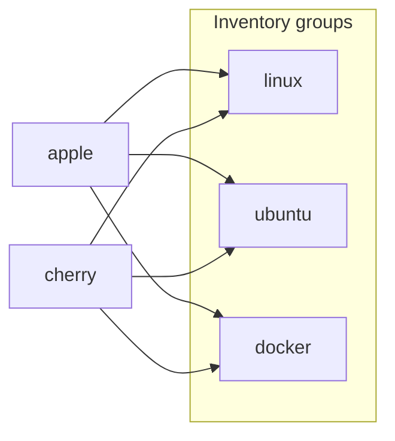

# ansible-pi-infra-nia

Ansible provisioning for two Ubuntu Linux development workstations — **apple** and **cherry**. The playbook applies security hardening, APT packages, Git configuration, Zsh (Antigen), Docker, and a host firewall.

**Python 3.12+** · [MIT License](LICENSE) · [Repository](https://github.com/Capp3/ansible-pi-infra-nia)

## What gets provisioned

The main playbook [`system-provision.yml`](system-provision.yml) runs four plays:

| Play | Hosts | Role / tasks |
|------|-------|--------------|
| System provisioning | `linux` | [`tasks/linux.yml`](tasks/linux.yml) + [`geerlingguy.security`](https://galaxy.ansible.com/geerlingguy/security) |
| SSH / shell | `linux` | GitHub SSH prep + [`viasite-ansible.zsh`](https://galaxy.ansible.com/viasite-ansible/zsh) |
| Docker | `docker` | [`geerlingguy.docker`](https://galaxy.ansible.com/geerlingguy/docker) (tag: `docker`) |
| Firewall | `linux` | [`geerlingguy.firewall`](https://galaxy.ansible.com/geerlingguy/firewall) |

Custom tasks in [`tasks/linux.yml`](tasks/linux.yml) handle:

- APT PPAs and package installation
- Workspace directories (`~/code`, `~/projects`, `~/media`, `~/backups/*`)
- Global Git config (name, email, editor, pull/push behavior)
- Optional GitHub CLI credential helper
- Hostname

Additional task files configure GitHub SSH known-hosts and remove stale HTTPS→SSH git rewrites before Zsh install.

SSH keys are managed manually on each host — Ansible does not deploy them.

## Prerequisites

- [Python 3.12+](https://www.python.org/) and [uv](https://github.com/astral-sh/uv)
- [just](https://github.com/casey/just) for workflow shortcuts
- SSH reachability to target hosts
- Optional: Ansible Galaxy token file `ag_token` at the repo root (see [`ansible.cfg`](ansible.cfg))

## Quick start

```bash
# 1. Create and encrypt secrets
cp vault/example.secrets.yml vault/secrets.yml
# Edit vault/secrets.yml with real values, then:
just vault-encrypt

# 2. Vault password (gitignored)
echo 'your-vault-password' > .vault_pass

# 3. Install Python deps and Galaxy roles
just install

# 4. Validate connectivity and dry-run
just ping
just check

# 5. Apply provisioning
just provision
```

`just ping` passes `-e @vault/secrets.yml` because ad-hoc commands do not load playbook `vars_files`. The playbook decrypts vault automatically via `vault_password_file` in [`ansible.cfg`](ansible.cfg).

## Inventory

Hosts are defined in [`hosts`](hosts):



| Host | Groups | Notes |
|------|--------|-------|
| `apple` | linux, ubuntu, docker | Includes `chroma` in `apt_install` |
| `cherry` | linux, ubuntu, docker | Same baseline as apple minus `chroma` |

Limit to a single host:

```bash
just provision host=apple
just check host=cherry
```

Apply only Docker tasks:

```bash
just provision-docker
```

## Configuration

Configuration is split across three layers:

| Layer | File | Purpose |
|-------|------|---------|
| Shared Linux defaults | [`group_vars/linux.yml`](group_vars/linux.yml) | Git settings, Zsh user, GitHub SSH host keys |
| Per-host overrides | [`host_vars/apple.yml`](host_vars/apple.yml), [`host_vars/cherry.yml`](host_vars/cherry.yml) | Connection vars, packages, security, firewall |
| Secrets | [`vault/secrets.yml`](vault/secrets.yml) | SSH host IPs/users/passwords, Git identity |

### Vault structure

Use [`vault/example.secrets.yml`](vault/example.secrets.yml) as a template:

```yaml
ssh_hosts:
  apple:
    ip: "..."
    user: "..."
    password: "..."
  cherry:
    ip: "..."
    user: "..."
    password: "..."

git:
  user_name: "..."
  email: "..."
```

Host vars reference vault values for connection:

```yaml
ansible_host: "{{ ssh_hosts.apple.ip }}"
ansible_user: "{{ ssh_hosts.apple.user }}"
ansible_become_pass: "{{ ssh_hosts.apple.password }}"
```

### Key settings

- **Git** — configured in [`group_vars/linux.yml`](group_vars/linux.yml); `git_settings.use_ssh` defaults to `false` (HTTPS for public clones; use `git@github.com:` URLs explicitly for SSH repos)
- **Docker** — login user and root added to `docker_users` in host_vars
- **Security** — password SSH authentication and passwordless sudo are enabled intentionally (homelab posture)

## Commands

Run `just` or `just --list` to see all recipes. Common workflows:

| Command | Description |
|---------|-------------|
| `just install` | `uv sync` + install Galaxy roles/collections |
| `just validate` | Syntax check, lint, and inventory graph |
| `just syntax` | Playbook syntax check only |
| `just lint` | Run `ansible-lint` |
| `just inventory` | Show resolved inventory graph |
| `just list-tasks` | List tasks that would run |
| `just ping [host=all]` | Ping hosts (loads vault via `-e`) |
| `just check [host=all]` | Dry-run with `--check --diff` |
| `just provision [host=all]` | Apply full playbook |
| `just provision-docker [host=docker]` | Apply Docker-tagged tasks only |
| `just vault-edit` | Edit encrypted secrets |
| `just vault-view` | View encrypted secrets |
| `just vault-encrypt` | Encrypt `vault/secrets.yml` |
| `just vault-decrypt` | Decrypt `vault/secrets.yml` |

## Development

```bash
just validate
```

Python tooling is managed via uv and declared in [`pyproject.toml`](pyproject.toml): `ansible`, `ansible-lint`, `ruff`, `mypy`. Galaxy roles and collections are listed in [`requirements.yml`](requirements.yml).

## Security

Never commit these files:

- `.vault_pass` — vault decryption password (gitignored)
- Unencrypted `vault/secrets.yml`
- `ag_token` — Ansible Galaxy API token

Password SSH and passwordless sudo are configured deliberately in host_vars for homelab use. Adjust [`host_vars/`](host_vars/) if you need a stricter posture.

## License

MIT — see [LICENSE](LICENSE).
